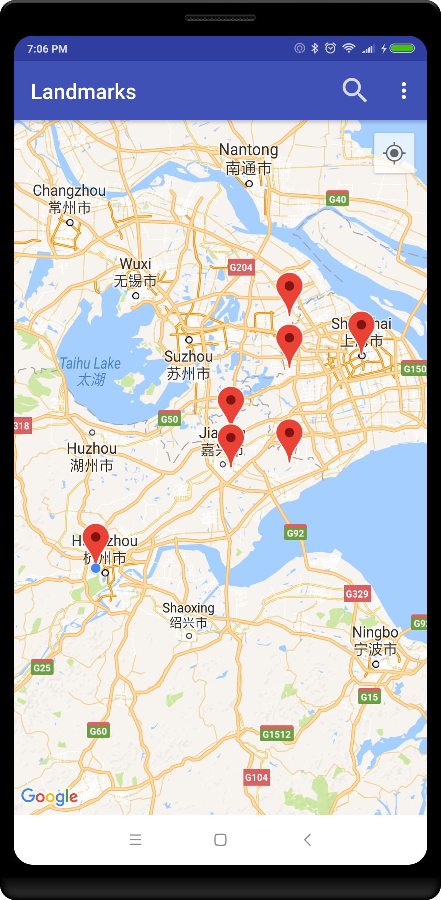
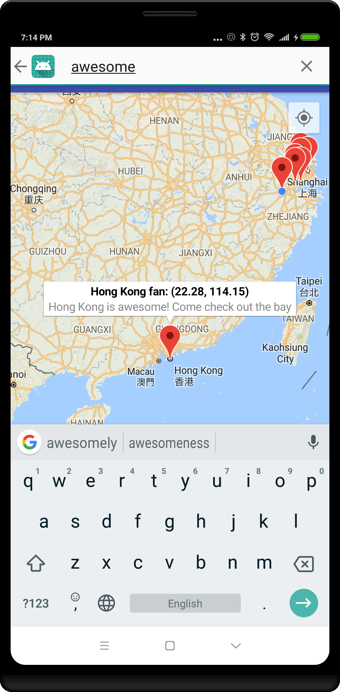
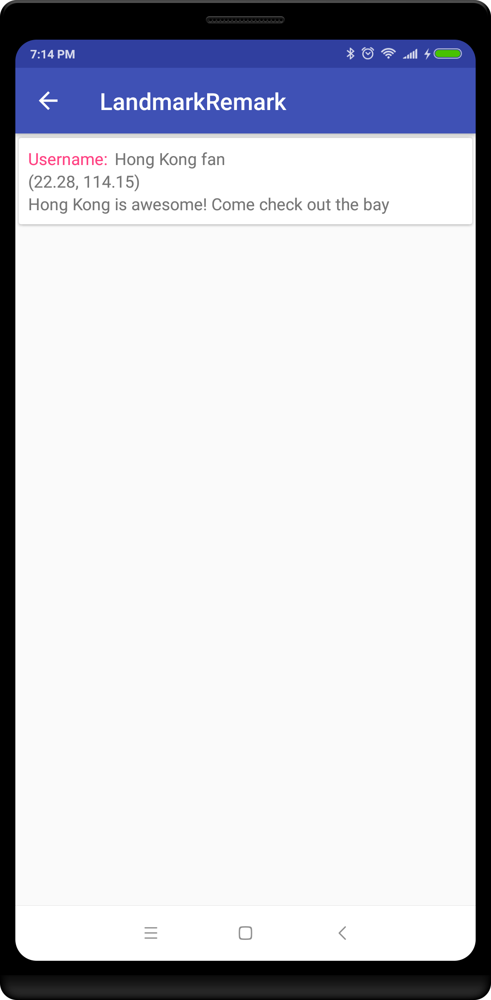

# Tigerspike - Landmark Remark Android App

Android application built to fulfill the Tigerspike project guidelines. Users can pin landmarks and add messages to them in a map application. The landmark remarks are synced across firebase to other users in realtime. [Test it out in the web browser!](https://appetize.io/embed/0zcq7e1vqyj4y18jdknbhtp474)

Please see the attached .pdf for the full project requirements.

## Design
The native Android application is written in Kotlin, with no third-party (non-Google) libraries (per the project requirements). For the backend-as-a-service provider, I chose to use Google Firebase due to its easy free tier. 

Important files:
- LandmarksActivity.kt - The main activity for this application. Besides implementing the normal Google maps SupportMapFragment, it also tracks the user's location with a FusedLocationProviderClient. It also fulfills the "view" part of the "Model-View-Controller" architecture:
	- LandmarksPresenter.kt - the "controller" handles the application's business logic, including communicating with the Firebase database
	- Landmark.kt - the "model" objects that are synced using Firebase
- SearchActivity.kt - a child activity to LandmarksActivity, it displays the results of a search across all landmarks

## Testing
Launch the application with one of the following methods:
- [Test it out in the web browser!](https://appetize.io/embed/0zcq7e1vqyj4y18jdknbhtp474)
- Open the project in Android Studio
	- debug using an emulator or usb device
	- or build apk and load it onto a device
- Load the debug apk included in the zipped project files (not included in git repo)

On application start, it may ask for permission to access your current location:
- if the location permission is denied, the application should still be able to be used. The user can see landmarks posted by other users, and search them. However, they will not be able to find their own location, or create any new landmarks.
- when the application is started and location permission is approved, then the user will have the ability to create a new landmark. Per the project requirements, they are only able to create the landmark at their current location. The primary way to create a new landmark is to click the blue dot representing the user's current location. A secondary way is to click the button to find the user's current location. After doing this, a snackbar message will appear with an action to immediately create a new landmark.

Try it with multiple devices:
- Add a new marker on one phone, and verify that it appears on the other

Searching:
- Click the search icon to being typing a searching query. Press the enter/return button on the Android keyboard to complete the search.
- Users can search on both username and message

Changing username:
- Click the Settings overflow menu (3 dots in the top-right) -> Change username.
- Type in a new username and now any new landmarks you make will have that new username

## Implicit requirements
- Back-end Persistence
	- Landmarks are synced across devices using Google Firebase
- Account / User authentication
	- In the interests of time, I have not implemented any authentication or persistence to a username. Any user can change their name at any time using the Settings option, and at log-in any user will be "Anonymous". If this was created for a real client I imagine this requirement would need to be more strictly implemented.
- Completely unable to delete or edit notes without going to the Firebase console.
	- In the interests of time, I have not added the ability to delete or edit landmark notes. With my current application structure, adding this functionality should be relatively straightforward. For a real client, I imagine this would be necessarily be implemented.
- Test Suite
	- To ensure the application's preformance and quality, it is recommended to create a suite of unit and instrumentation tests. However, in this case I did not build any due to lack of time and inability to use third-party libraries. 

## Limitations 
- Not very usable in China or other countries where Google services are blocked
- Somewhat reliant on location permissions
	- per the requirements, users can only save a landmark at their current location
	- if they say no, the app can still be used to look at and search landmarks. However, they won't be able to add their own.
	- if someone deny's the location request, then closes and reopens the app, they will be reprompted and will have the ability to allow the request

## Time estimation
As mentioned in the project requirements, here is a conservative estimate of the time taken for the various parts of the application development:
- Initial map + firebase sync - 1.5hr
- Current location + permissions - 2hr
- Re-doing current location + permissions - 1.5hr
- Adding landmarks - 1 hr
- Searching landmarks - 2hr
- Final testing, code cleanup, documentation - 2.5 hr

## Screenshots:

